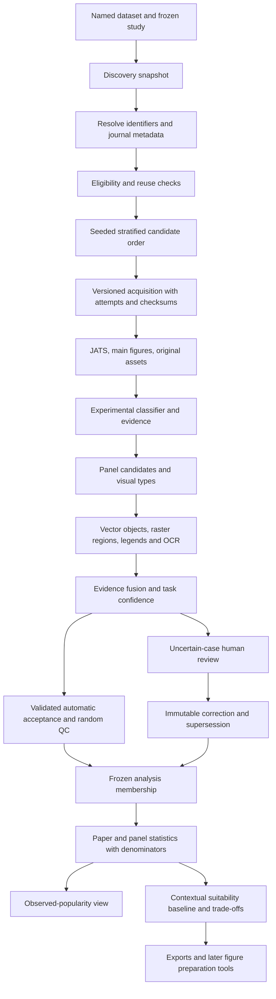

# Scientific Palette Lab / Chromatic: repository review and implementation plan

**Review date:** 30 September 2026, America/Los_Angeles.  
**Reviewed repository:** LincolnGothic/scientific-palette-lab, default branch `main`.  
**Pinned commit:** [`192abce8f86777911df0e1b4d62340c2a19e92f5`](https://github.com/LincolnGothic/scientific-palette-lab/tree/192abce8f86777911df0e1b4d62340c2a19e92f5).  
**Deliverable status:** proposed architecture and execution plan only. No application-code changes, database migration, deployment, or feature implementation were performed during the review. This review is published as documentation.

This document covers all 15 requested deliverables and maps all 33 requirements to incremental work. The recommended approach is to evolve the existing application into a versioned research pipeline while retaining its lightweight server, SQLite, deterministic algorithms, and scientific safeguards.

## 1. Assessment of the current architecture

The application is a compact, coherent v0.1 prototype. Its runtime dependencies are NumPy and Pillow, its backend is `ThreadingHTTPServer`, its database is SQLite in WAL mode, and its frontend is vanilla JavaScript with local static assets. There is no JavaScript build requirement or mandatory model service.

| Component | Actual implementation at the reviewed commit | Assessment |
|---|---|---|
| Study configuration | `config.py`: fixed Nature/Science/Cell ISSNs; `Study` defaults to 2021–2025 and ΔE76 8 | Useful Flagship preset, but validation prevents a PMC-wide study |
| Discovery and collection | `corpus.py`: Europe PMC cursor search, publication-date descending, per-journal scanned-record limit; versioned official PMC S3 metadata/JATS/media retrieval | Source adapters are worth retaining; orchestration conflates several research stages |
| Version and retrieval policy | Published-version preference, optional manuscripts, retraction/license checks, allowed retrieval hosts, bounded downloads, retries, supplied MD5 verification | Good foundation, with provenance and policy gaps described below |
| Figures and panels | `figures.py`: main JATS figures including floats-group; supplementary/extended-data exclusions; whitespace-gutter proposals | An auditable baseline, not a validated automatic detector |
| Classification | `classify.py`: caption keywords returning data/flowchart/unknown | No visual evidence, subtype taxonomy, experimental classifier, or calibrated probability |
| Raster extraction | `colors.py`: white alpha compositing; pixel subsampling; weighted RGB bins; greedy Lab merging; neutral exclusion option | Deterministic baseline, but every result has low confidence and needs manual semantic selection |
| Storage | `store.py`: five tables—papers, figures, panels, reviews, runs—with several JSON fields | Effective small-workspace store; lacks migration/versioned-study/result-selection architecture |
| Statistics | `statistics.py`: one paper vote per family; separate panel counts; encoding/count-specific denominators; complete-link grouping; real-member medoid; optional deterministic paper bootstrap | Several scientifically valuable definitions already exist and should be retained |
| Recommendations | `recommend.py`: reviewed observed families plus separately labeled references; transparent weighted formula; locked color/background/CVD options | A suitable baseline, already explicit that frequency does not establish quality |
| UI/API | `app.py` and `web/app.js`: atlas, recommendations, review, collection, methods, import and exports | Usable interface, but it transfers all active panels in state and refreshes them during collection polling |
| Deployment | Docker on Python 3.12; Render Blueprint; one instance; 1 GB persistent disk; Basic authentication behind HTTPS; host/origin checks | Reasonable personal-workspace model, not capacity-tested for Core-500 |
| Tests/docs | Three unittest files, README, VALIDATION, hosting documentation, three preview JPEGs | Covers important invariants; not a quantitative scientific benchmark or an automated CI system |

Source anchors: [study validation](https://github.com/LincolnGothic/scientific-palette-lab/blob/192abce8f86777911df0e1b4d62340c2a19e92f5/palette_lab/config.py#L15), [collection](https://github.com/LincolnGothic/scientific-palette-lab/blob/192abce8f86777911df0e1b4d62340c2a19e92f5/palette_lab/corpus.py#L130), [schema](https://github.com/LincolnGothic/scientific-palette-lab/blob/192abce8f86777911df0e1b4d62340c2a19e92f5/palette_lab/store.py#L26), [statistics](https://github.com/LincolnGothic/scientific-palette-lab/blob/192abce8f86777911df0e1b4d62340c2a19e92f5/palette_lab/statistics.py#L43), [baseline recommender](https://github.com/LincolnGothic/scientific-palette-lab/blob/192abce8f86777911df0e1b4d62340c2a19e92f5/palette_lab/recommend.py#L73).

### Verification performed for this review

All tracked Python, JavaScript, HTML, CSS, configuration, tests, and text documentation were inspected. The application preview was visually inspected. Preview images are illustrations of the UI, not evidence of corpus accuracy.

- Ran all **35 existing tests** on Windows with Python **3.12.14**, NumPy **2.3.5**, and Pillow **12.3.0**: **33 passed, 1 failed, 1 errored**.
- The available-port test uses `select.select()` on a subprocess stdout pipe; Windows raised `WinError 10038`. This is a test portability defect, not evidence that the server cannot start.
- The occupied-port test reproduced `WinError 10013` rather than the `errno.EADDRINUSE` case handled by the CLI; it emitted a traceback and failed the expected actionable-message assertion. Do not indiscriminately relabel every permission-denied bind as a port conflict; handle and explain the actual OS error.
- `node --check palette_lab/web/app.js` passed.
- Exercised the existing categorical Python export function in a minimal Node harness; its output contained real newlines and parsed into four Python statements. This was one export smoke check, not full browser E2E testing.
- Reviewed Docker/Render configuration statically. Docker was unavailable; no container build or live deployment was verified. Wheel packaging and Python 3.10/3.11/3.13 matrices were not rerun in this review.
- The repository has no tracked `.github` workflows or standard license/contribution/citation files. The checkout remained clean after verification.

To respect the user's deletion rules, the audit harness retained generated test directories and duplicate-upload assets rather than deleting them. It also avoided Windows sandbox permission problems from the standard temporary-directory constructor by using ordinary directories. Cleanup behavior was therefore **not tested**. The first attempt encountered sandbox temporary-directory permission errors; those are not counted as application failures. The final run and its two remaining failures are recorded in `baseline-verification.json` beside this document.

`VALIDATION.md` reports a historical acquisition smoke test of 11 papers and 54 figures, including accepted manuscripts, and states that downloaded real figures were unreviewed. The data directory is excluded from Git; those figures, their retrieval success, and their licenses were not independently revalidated here. Its test results and browser/build claims are historical reports, not fresh evidence from this review.

## 2. Major weaknesses and priorities

| Priority | Evidence in the current code | Consequence | Proposed response |
|---|---|---|---|
| P0 | `collect()` calls `put_paper()` only after version, XML, article-type, and journal checks | Metadata candidates and failed acquisition records do not exist as queryable article rows | Persist discovery first; keep eligibility, availability, selection, and acquisition separate |
| P0 | `Study.validate()`, `Store.put_paper()`, CLI choices and import UI all restrict three journals | A PMC-wide corpus cannot be represented | Make Flagship a named preset; use journal identifiers and study membership |
| P0 | `is_demo` is the only dataset discriminator | Core, Flagship, Benchmark and Synthetic cannot have separate study membership, filters or analysis policies | Named datasets plus frozen study versions and membership |
| P0 | `CREATE TABLE IF NOT EXISTS` is the evolution mechanism | No safe upgrade path for existing reviewed databases | Versioned SQL migrations, explicit legacy import, backup/restore verification |
| P0 | `set_extraction()` overwrites current colors and revokes approval; review snapshots store submitted values rather than a complete input/output snapshot | Re-extraction and old reviews cannot reliably reproduce every prior region/method/input combination | Append immutable result revisions and full review snapshots; preserve an explicit selected result |
| P0 | `review()` changes paper eligibility when a panel is reviewed; only panel revision is checked | A stale second panel can change article-wide eligibility without an article-wide conflict check | Study-scoped article decisions with their own revision and evidence |
| P1 | Every statistical entry requires `reviewed=1` and paper inclusion | Review effort scales with every panel; automation cannot enter analysis safely | Separate automatic acceptance, human acceptance, confidence, and analysis membership |
| P1 | Date-descending scan limit; no frozen frame, quotas or seed | First-record pilots have unknown selection bias | Frozen candidate snapshot and reproducible stratified sampling |
| P1 | Only raster suffixes are matched; downloads become normalized PNGs | Vector information and original-byte evidence are lost from the analytical path | Preserve original assets now; vector/PDF adapters in v0.3 |
| P1 | White compositing, regular-stride sampling, top-2048-bin processing, minimum area thresholds, default neutral exclusion | Thin marks, dark backgrounds, controls, compression and gradients can be mishandled | Versioned raster baseline plus semantic masks, mark/legend evidence and targeted fixtures |
| P1 | Caption keywords and whitespace splitting only | Composite panels and visual classes remain unresolved | Independent detection/classification evidence and abstention |
| P1 | Extraction bbox is validated against the figure, not against the selected panel (`app.py:112`) | Colors from adjacent panels can enter a panel result | Enforce region containment; represent shared external legends with explicit cross-panel links later |
| P1 | `by_journal` and `by_year` count panels within a family | These fields cannot be interpreted as paper-level journal/year comparisons | Keep compatibility fields labeled as panel counts; add per-stratum paper numerators and denominators |
| P1 | All panels are returned by `/api/state`; jobs live in process memory and end-run reports are written only at collection completion | Poor scaling and incomplete crash recovery | Persist tasks/checkpoints; paginated panel endpoints and compact progress polling |
| P1 | No CI, migration tests, calibrated confidence or real ground truth | Passing implementation tests does not measure scientific extraction performance | Engineering CI plus separate scientific validation gates |
| P2 | Recommender still combines prevalence and suitability in one baseline score | It can be mistaken for a general design-quality ranking | Preserve that named baseline; expose popularity and suitability as different views |
| P2 | 1 GB disk, 512 MB-class deployment, unconstrained simultaneous expensive requests | Core-500 may exhaust disk/RAM | Capacity pilot, resource limits, one analysis worker and tested backups |
| P2 | Missing LICENSE, CONTRIBUTING, CHANGELOG, CITATION and templates | Reuse expectations and collaboration process are unclear | Add owner-approved project governance documents |

This is an evolution plan, not an indictment of the prototype. Its existing paper-vote, palette matching, medoid, role preservation, demo isolation, source checking and explicit recommendation limitations are assets.

## 3. Design assumptions and alternatives

**Confirmed by the user:** experimental means laboratory, animal, or interventional research. Purely observational and computational papers are excluded. Mixed studies can qualify when substantive experimental work is supported by Methods/captions; preserve the supporting sections and reason. Trials with observational follow-up require the same policy rather than a title-only decision.

Other proposed defaults, to be confirmed before executing their corresponding PRs:

| Decision | Recommended starting point | Alternatives and implications |
|---|---|---|
| Hosting scope | One personal/trusted-group workspace | Multi-user institutional access needs identities, permissions, durable workers and a separate architecture decision |
| Core date range | A user-selected closed interval; initial preset 2023-01-01 through 2025-12-31 | Keep the legacy Flagship 2021–2025 preset; partial 2026 is a separate explicit option, never an implicit rolling window |
| JIF rule | Optional strict `>5` only when an authorized metrics snapshot is supplied | None, `>3`, `>10`, custom; if a requested metric is missing, mark unresolved and do not pretend the criterion passed |
| Metric-year rule | Pin one authorized metric year for the initial study | Publication-year matching or latest-available-at-freeze are separate policies with different temporal biases |
| Corpus target | About 500 eligible acquired papers, independently tracked from analyzable panels | A 500-paper final-analysis target needs a prespecified reserve/replenishment policy and will usually require more candidates |
| Paper version | Final published versions by default | Licensed manuscripts remain opt-in, explicitly labeled and analyzed separately |
| Main figures | Include main research figures, exclude supplementary/extended-data by default | Preserve uncertain figure-scope decisions; do not silently discard unrecognized labels |
| Initial automation | Local rules, deterministic vision, benchmark/calibration support; automatic acceptance only for validated tasks/classes | Optional local models or paid backends compete against the same baseline and can abstain |
| Code license | Propose MIT for owner consideration | The owner must choose a license; manuscript assets, JCR data and model weights retain their own licenses |

### Architecture choices

1. **Recommended: modular evolution of the current stack.** Retain SQLite and HTTP server. Introduce study/provenance/results boundaries and a single durable worker. Add scientific capabilities incrementally. Lowest migration burden and easiest baseline comparisons.
2. **Continue with directories and richer JSON only.** Cheap initially, but weak joins, history selection and reproducible comparisons make it unsuitable as the long-term design. Content-addressed files remain useful for large immutable artifacts.
3. **Full service/database rebuild.** Defer FastAPI/PostgreSQL/object-store queues until concrete needs arise: separate user access, several independent workers, sustained SQLite writer contention, institutional deployment or remotely shared storage. Corpus size alone is not a reason to change frameworks. Durable single-worker jobs can be implemented with SQLite now.

## 4. Proposed architecture and end-to-end flow

Use a small number of domain boundaries; do not build a generic workflow platform. The backend and CLI call the same functions. Plugins return evidence through a narrow versioned contract; unavailable backends produce explicit abstentions, not fabricated predictions.

Not every stage is strictly linear. Experimental classification can use metadata before sampling and Methods/captions after full-text acquisition; evidence updates are recorded. Figure-type stratification is unavailable before figures are processed, so use it for benchmark/QC strata or a clearly labeled second-phase sample, not as a hidden input to initial discovery.

### Stage contracts and failure behavior

| Boundary | Input | Output persisted before continuing | Failure/abstention behavior |
|---|---|---|---|
| Discovery | Source query and exact date window | Run/query/page snapshots, every discovered identifier, retrieval time and raw metadata hash | Keep partial snapshots and cursor; report incomplete frame |
| Resolution | Discovered record | Canonical article identity, DOI/PMCID/PMID aliases, journal identifiers, date/type evidence | Preserve unresolved record; identifier conflicts need resolution, not merging by title alone |
| Eligibility | Study, metadata, metrics and license policy | Per-rule pass/fail/unknown with evidence and classifier version | Exclusion is separate from a network error; unknown is not pass |
| Sampling | Frozen candidate frame, quotas, seed | Candidate priority, stratum, primary/reserve selection, policy hash | Sparse/capped strata and quota relaxations are explicit |
| Acquisition | Selected candidate and allowed source adapter | Version metadata, retrieval attempt, original bytes, supplied checksum and SHA-256 | Bounded retry; record 404, embargo, unavailable version, checksum mismatch and partial figure coverage distinctly |
| Figure inventory | Selected article version and JATS | Figure record even if no downloadable asset; scope/label/caption/hrefs | Missing media must not erase figure/article rows |
| Automatic analysis | Asset/region and versioned algorithm | Immutable outputs, evidence, runtime, limitations, model/parameter hashes | Unsupported PDF colors, missing OCR/model and mixed imagery cause fallback or abstention |
| Acceptance/review | Task confidences and study policy | Automatic/human decision, QC flag, input revision, reviewer identity if supplied | LOW never enters final statistics automatically; review protects its exact result revision |
| Analysis | Explicit article/result membership | Manifest, immutable selected result IDs, algorithm/metric/threshold and counts | Unaccepted/unresolved units appear in coverage, not in numerator or an invented denominator |

### Acquisition states

Do not use a single overloaded `status` column. Keep three axes: study eligibility, acquisition stage, and analytical acceptance. Add terminal reason codes and an append-only attempt/event history.

Derived coverage must distinguish: discovered; metadata resolved; criteria satisfied; reusable full text confirmed; selected; figure assets available; acquired; processing completed/partial/failed; excluded; retrieval error; analysis accepted. A paper can satisfy eligibility while having incomplete figures or a failed retrieval. Retry does not change its eligibility.

The UI should show both a funnel of distinct article counts and an outcome table. Each count has a stage definition, base population, partial/unresolved counts and timestamp. Attempts are never counted as additional papers. Exclusions/errors can overlap stages, so they are not all additive funnel buckets.

### Concrete proposed application contracts

The following routes are additive v0.2 contracts; existing v0.1 routes stay as compatibility adapters. All new routes use the current authentication/host/origin boundary. Core-domain functions are called by both the CLI and handlers rather than having CLI commands call a local HTTP endpoint.

| Route / command | Contract |
|---|---|
| `GET /api/v2/datasets` | Named dataset ID/slug/kind and available frozen study versions; no implicit pooled corpus |
| `POST /api/v2/studies` | Validated definition with dataset ID, exact dates, strict experimental policy, license/version policy, metric import/year/operator, sampling parameters and seed; returns draft study-version ID/hash |
| `POST /api/v2/studies/{id}/freeze` | Freezes validated study definition; a changed definition gets a new revision |
| `POST /api/v2/studies/{id}/discover` | Starts a persisted discovery job; returns job ID and run ID, not a completed acquisition claim |
| `POST /api/v2/studies/{id}/sample` | Requires frozen frame; produces immutable frame/selection/reserve manifest with shortfalls |
| `POST /api/v2/studies/{id}/acquire` | Requires recorded selection/version policy; resumes checkpointed acquisition |
| `GET /api/v2/studies/{id}/coverage` | Distinct articles by defined stage/stratum, excluded/error/partial counts, base population and timestamp |
| `GET /api/v2/articles?study_version_id=…&cursor=…&limit=…` | Stable paginated article/state summaries; bounded limit, not full asset/results payloads |
| `GET /api/v2/panels?study_version_id=…&cursor=…&limit=…` | Paginated panel/current-selected-result summaries; detail and history loaded on demand |
| `GET /api/v2/jobs/{id}` | Compact persisted stage/status/checkpoint/error summary; polling never returns every panel |
| `POST /api/v2/results/{id}/review` | Exact result and article decision revision tokens, decision/evidence; appends full immutable annotation |
| `POST /api/v2/analyses` | Frozen study ID, explicit acceptance policy/result selection, metric/threshold; returns immutable analysis ID |
| `GET /api/v2/analyses/{id}/manifest` | Canonical manifest with selected article/result/input hashes and environment/version information |
| `palette-lab metrics import <file>` | Validate/store authorized source, print import ID/hash and conflict report |
| `palette-lab study discover/sample/acquire/export --study <id>` | Same domain contracts as the routes; sampling/acquisition target distinct from a discovery scan cap |
| `palette-lab validate --benchmark <version> --run <id> --split <role>` | Offline version comparison; locked-test access logged and never used for tuning |

v2 should distinguish malformed input (400), missing resource (404), stale review or invalid stage transition (409), and bounded-resource refusal (413). Preserve the v0.1 response contract while it is supported. This is an API proposal, not an implemented endpoint list.

## 5. Corpus and sampling design

### Named datasets

- **Core-500:** stratified PMC-machine-accessible experimental papers; frozen dates, optional metrics criterion and reuse/version policy.
- **Flagship:** Nature, Science, Cell by exact ISSN, retaining legacy behavior and historical results.
- **Benchmark:** real figure/panel labels with development, calibration and locked-test roles.
- **Synthetic:** generated charts with exact semantic ground truth; existing demos become a tagged illustrative subset.

An article may belong to multiple named datasets, but analyses use explicit study membership and one canonical paper vote. Benchmark split restrictions follow article/duplicate identity across all memberships. Dataset separation does not rely on different copies of a database or on assigning fake journal names to synthetic figures.

### Recommended first Core-500 design

Treat the initial study as a **balanced descriptive sample of a defined PMC-accessible frame**, not a probability census of all published scientific figures.

1. Discover the entire configured date/type/source frame, with cursor checkpoints and a bounded query partition strategy. Persist snapshot identifiers and metadata. A scan cap produces a labeled pilot, never a complete-frame claim.
2. Resolve journal ISSNs/aliases and reusable version availability. Apply the selected metrics snapshot and strict experimental policy. Keep Methods-based eligibility pending until the relevant text is acquired.
3. Derive broad subject groups reproducibly from available MeSH/JATS/metadata. Save taxonomy version, mapping rules and assigned evidence. Use a deterministic primary group for sampling; retain all other subject tags for analysis. Missing terms are an `unclassified` stratum, not grounds for silent omission.
4. Use **year × broad subject** as primary strata. Allocate about equally across years; within year use square-root-of-frame-size allocation with a small minimum for viable groups. This reduces dominance without forcing an enormous sparse cross-product.
5. Start with a maximum of **25 papers per journal** in a 500-paper target and a broad-subject ceiling of approximately **35%**. These are prespecified balancing choices, not claims that those proportions represent publishing output. Quotas are proposed defaults and must be checked for feasibility before sampling.
6. Use a seeded generator or stable keyed random priority over canonical identifiers; save the generator/version, seed, tie-break rule, full priority list, initial allocations and cap policy. Sampling must be invariant to provider response order.
7. Create a prespecified ordered reserve, initially roughly **50% of the target**. A pilot estimates eligibility/acquisition yield and may justify a larger reserve through a new study revision. Draw replacements from the same stratum for prespecified article ineligibility/unavailable acquisition only. Record the original selected article, reason and replacement. Never replace a paper because its palettes are unattractive or difficult to analyze.
8. Freeze both the original draw and the acquired eligible cohort. Stop at the recorded target or an explained shortfall. If figure processing later fails, retain the selected paper and report missingness; do not replenish with easier figures to obtain a favorable result.

If five years are selected, the initial year allocation is about 100 each; for three years, approximately 167/167/166. Exact quotas use a documented largest-remainder allocation and deterministic handling of sparse strata. Journals remain a secondary balancing constraint rather than a giant journal×field×year grid. Before acquisition, report whether the available frame can satisfy the journal cap; any relaxation needs a recorded study revision, not an invisible sampler adjustment.

**Important statistical qualification:** journal caps, reserve substitution, and post-acquisition eligibility make simple `n_h/N_h` weights incorrect for this constrained design. v0.2 should publish descriptive results and the full selection process, with inclusion probability left null unless justified. For frame-level inference in v0.5, either adopt a tractable probability design with known inclusion probabilities or validate design-specific probabilities with simulation and account for nonresponse. Do not report a weighted population estimate just by inverting observed cell counts. OA access and unknown experimental eligibility still limit generalization.

### Journal metrics

Import an authorized CSV/JSON table containing journal name, print/electronic ISSN or ISSN-L, metric name (`JIF`), numeric value, metric year, source and source version. Validate ISSN format/checksum, nonnegative finite values, duplicate keys and conflicting aliases. Store the complete file hash, import time, authorization/reuse note and mapping decisions. Keep different sources/years as different records.

Threshold comparison must be explicit (`>` versus `>=`); values equal to 5 fail a `>5` rule. Missing metrics are **unknown**, not zero. A no-threshold study does not need metrics. A strict-threshold study cannot be finalized until unresolved metric cases are resolved or explicitly excluded. CiteScore/SJR may be separate named metrics later; they must never silently substitute for JIF.

JIF is a journal sampling attribute. It must not enter extraction confidence, figure-quality labels, suitability scores or benchmark truth. Clarivate itself identifies JIF as a journal-level metric. Authorized imports are preferable to fabricated or scraped values. [Clarivate JCR guidance](https://clarivate.com/academia-government/scientific-and-academic-research/research-funding-analytics/journal-citation-reports/), [journal API](https://developer.clarivate.com/apis/wos-journal).

## 6. Proposed revised database schema

Keep SQLite, foreign keys and WAL. Use numbered, checksummed SQL migrations with `schema_migrations(version, checksum, applied_at, app_commit)`. An explicit legacy-adoption migration recognizes the exact v0.1 schema; it refuses unknown partial schemas. Fresh creation and upgrades use the same migration path. Add tables when their release needs them rather than scaffolding every future subsystem in v0.2.

The names below are proposed, and the columns describe the intended contracts rather than executed DDL. UUID/text IDs may remain, but uniqueness constraints must protect scientific identity independently of those IDs.

### Foundation tables for v0.2

| Table | Principal columns and constraints | Why it is needed |
|---|---|---|
| `datasets` | id, unique slug, name, kind (`core/flagship/benchmark/synthetic`), description, created_at | Explicit separation and selectable scope |
| `study_versions` | id, dataset_id FK, study_name, revision, definition_json, definition_hash, frozen_at, supersedes_id; unique name/revision | Immutable eligibility/sampling/analysis policy |
| `journals` | id, canonical_name, ISSN-L if known, metadata_json | Names change; identifiers should drive matching |
| `journal_identifiers` | journal_id FK, scheme, normalized_value, provenance; unique scheme/value | Print/electronic ISSN and source aliases |
| `metric_imports` | id, metric_name, source, source_version, asset_id, hash, imported_at, rights_note | Authorized metrics snapshot and provenance |
| `journal_metrics` | journal_id FK, import_id FK, metric_year, value; unique journal/import/year | No hard-coded current JIF values |
| `articles` | id, journal_id FK, title, publication_date/year, article_type, metadata_json | Canonical paper identity independent of retrieval |
| `article_identifiers` | article_id FK, namespace (`doi/pmcid/pmid/provider/synthetic`), normalized_value; unique namespace/value | Deduplication and identifier-resolution audit |
| `article_versions` | id, article_id FK, source, source_version, version_type, license_code/URI/text, metadata_asset_id, metadata_hash, source_url, retrieved_at, retracted flag, supersedes_id | Parallel published/manuscript/source versions and changed metadata |
| `pipeline_runs` | id, study_version_id, stage, provider, config_json/hash, seed, frame_asset_id/hash, code_commit, started/finished_at, status, report_asset_id | Discovery, sampling and processing manifests without one table for every counter |
| `study_articles` | study_version_id/article_id PK, selected_version_id nullable, resolution/eligibility/acquisition states, rule_evidence_json, stratum_json, selection_rank, selection_role, replaced_article_id, exclusion_reason, decision_revision | Query every discovered candidate; membership and denominators are study-specific |
| `acquisition_attempts` | id, run_id, article_id/version_id, figure_id nullable, stage, URI, started/finished_at, HTTP outcome, error_code, retryable, supplied_checksum, actual_sha256, asset_id nullable | Preserve every attempt; distinguish unavailable from transient error |
| `assets` | id, unique SHA-256, relative_path, MIME, byte_size, derived_from_asset_id, transform_json | Original bytes, metadata/JATS and derived images are distinct immutable content objects |
| `asset_sources` | id, asset_id FK, run_id, article_version_id nullable, source_uri, retrieved_at, supplied_checksum_algorithm/value, license/provenance_json | The same bytes can have multiple retrieval origins/rights; content deduplication must not overwrite source evidence |
| `figures` | id, article_version_id FK, external_key, label, caption, scope, scope_evidence_json, preferred_asset_id/source_id nullable; unique version/external_key | A figure exists even when media are absent |
| `panels` | Existing stable panel ID, figure_id, parent_panel_id nullable, bbox, coordinate_asset_id, active/current-selection reference, created_by, created_at | Preserve legacy IDs and split lineage; coordinates identify the exact source representation |
| `algorithm_versions` | id, stage, name, version, commit, parameter_schema_version, model_hash nullable, dependency/environment_hash, license_json | Version every decision, including deterministic baselines and manual edits |
| `result_revisions` | id, panel_id FK, run_id, algorithm_version_id, input_asset_id/source_id, input_hash, panel_bbox, extraction_bbox, kind/subtype, encoding, colors/roles_json, extraction/evidence_json, task_confidence_json, output_hash, supersedes_id, reanalysis_reason | Full immutable input/output snapshot; current panel fields become a compatibility projection |
| `annotations` | id, study_version_id, article_id XOR result_revision_id, task, decision, complete_snapshot_json/hash, reviewer_label nullable, created_at, supersedes_id | Immutable article decisions and panel reviews, rather than overwritten eligibility |
| `analysis_runs` | id, study_version_id, manifest_asset_id/hash, metric, threshold, grouping_version, analysis_policy_hash, created_at | Freeze analysis parameters and result population |
| `analysis_members` | analysis_run_id/result_revision_id PK, article_id, acceptance_source, annotation_id nullable, confidence_policy_version | Record the exact panels/results that generated statistics |
| `benchmark_members` | benchmark_version, panel_id/result_revision_id, article_group_id, split, label_annotation_id, difficulty/type tags; unique benchmark/member | Paper-disjoint benchmark assignment and audited labels |
| `validation_runs` | id, benchmark_version/hash, pipeline_run_id, metrics_asset_id/hash, protocol_version, split, code/environment hashes | Compare versions quantitatively with fixed evaluation inputs |
| `jobs` | id, run_id, stage, status, task_manifest_json, checkpoint_json, attempt_count, last_error, lease/heartbeat, timestamps | Minimal durable single-worker recovery; task identity/checkpoints can remain JSON initially |

`pipeline_runs` references immutable frame and sampling-plan JSON assets. For the initial 500-paper scale, this avoids premature tables for every stratum/quota while still retaining machine-readable records. `study_articles` stores final selection rank/stratum and stage state. Normalize job tasks or sampling units later only when resumability/query load requires it.

### Later additions with an actual consumer

| Release | Table | Principal contents |
|---|---|---|
| v0.3 | `figure_assets` | Figure↔asset link, original/vector/raster/PDF-page role, page and coordinate transform; multiple representations |
| v0.3 | `extraction_regions` | Result revision, source asset, rectangle/polygon/mask asset, region role, detector/manual origin, algorithm ID |
| v0.3 | `color_observations` | Region, original color space/components/profile, normalized sRGB/Lab/OKLab, opacity, rendered-background context, semantic role, object/area support, confidence |
| v0.3 | `legend_entries` | Result, legend bbox, swatch region, label text/OCR evidence, swatch↔mark links and confidence |
| v0.4 | `predictions` | Article version XOR panel/result target, task, backend/algorithm, class probabilities, raw score, calibration version, evidence groups and abstention |
| v0.4 | `panel_sets` | Figure, detector run, proposed/accepted set, supersedes set, annotation protecting reviewed boundaries |
| v0.4 | `review_queue` | Task/result, reason, priority components, assignment/state, QC/random/active-learning origin |
| v0.5 | `palette_families`, `family_members` | Analysis-run-scoped family IDs, representative result and exact result memberships |
| v0.6 | `recommendation_runs` | Inputs, baseline/strategy version, candidates, dimensions, constraints and trade-off explanations |
| v0.7 | `uploaded_figures`, `recoloring_runs` | User workspace assets and proposed mappings/previews, explicitly outside literature corpus |

Synthetic generation manifests can be assets linked to the Synthetic dataset and result revisions; a dedicated `synthetic_examples` table is unnecessary until generation queries justify it. Predictions in v0.2 are versioned evidence JSON with the same future contract; do not expose them as calibrated probabilities until calibration exists.

### Required constraints, history and indexing

- All references use foreign keys; scientific-history deletion is restricted. Use supersession/retirement, not cascading deletion of review history.
- Validate structured JSON against a versioned schema at the application boundary. Use numeric bbox columns or validated JSON consistently; require finite coordinates and explicit units/transforms.
- Partial or composite unique keys prevent duplicate article identifiers, figure-version keys, study membership and analysis membership. DOI absence is not a duplicate empty-string identifier.
- Index article journal/date, study states, figure version, panel figure/active, result panel/time, and attempts article/stage. Add query-plan evidence before extra indexing.
- An accepted annotation refers to its exact result/input hashes. New automatic results never change that association or the selected reviewed result.
- Panel proposals do not replace reviewed boundaries. Acceptance creates a new panel set/supersession and retires old analytical membership only through an explicit new analysis snapshot.
- Article eligibility is per study and has its own revision token. Changing it cannot silently rewrite a historical analysis or another panel's paper-wide decision.
- Prevent active benchmark-test identities from entering training/development via any dataset membership. Check duplicates and related article versions, not just panel IDs.

### Migration and backward compatibility

1. Create a verified SQLite online backup plus immutable asset inventory. Never copy only a live `corpus.sqlite3` while ignoring WAL and active writes.
2. Recognize v0.1 exactly, register its baseline algorithm IDs and migrate legacy real papers into **Flagship**, demo papers into **Synthetic/illustrative**.
3. Preserve paper, figure and panel IDs. Import existing reviews as legacy annotations with their actual completeness recorded; do not invent missing input versions, reviewer identities, licenses or timestamps.
4. Create immutable revisions from current panel state. Existing current-state rows remain readable as projections while callers migrate. Do not drop old tables in v0.2.
5. Alias API `dataset=real` to legacy Flagship and `dataset=demo` to illustrative Synthetic. New clients send explicit dataset/study/analysis IDs; invalid IDs return a clear error. Never change `real` to silently mean Core-500.
6. Retain ΔE76, complete-link/bottleneck matching, palette order/roles and the exact deterministic recommendation formula for legacy analysis. CIEDE2000 needs a new analysis, not an update to historical outputs.
7. Reject an unknown newer schema on startup. On migration failure, leave the original recoverable and the application unavailable for writes; test recovery from the verified backup. Do not promise destructive downgrade migrations.

## 7. Confidence, automatic processing and human review

The processing unit needs **task-specific confidence**: experimental eligibility, panel boundaries, figure type, color extraction, legend mapping and semantic interpretation. A successful vector parse is strong evidence for numerical ink colors but not for semantic data-color selection. End-to-end acceptance must satisfy every required task policy.

### Evidence fusion

Group evidence by its underlying source: metadata/JATS/caption, image geometry/OCR, vector objects, raster marks/legend relationships, optional visual classifier. Two models reading the same caption do not supply independent evidence. Store evidence spans, object/region IDs, support/disagreement and known limitations.

Begin with transparent agreement/veto rules. Require at least two relevant evidence groups, no contradictory hard evidence, a supported input class, and validated error bounds. Introduce calibrated logistic/other simple fusion only if it improves validation. Save raw scores separately from calibrated probabilities, including calibration dataset/version. Missing evidence produces uncertainty, not a fabricated probability.

| State | Meaning and analysis policy | Review policy |
|---|---|---|
| HIGH | Meets the validated acceptance policy for that task/class; eligible for explicit automatic acceptance | Stratified random QC, initially 10% or a study-specific minimum; rates adapt only through recorded policy revisions |
| MEDIUM | Plausible, but below automatic acceptance requirements | Default pending for final statistics; can appear in explicitly exploratory sensitivity outputs |
| LOW | Conflicting/unsupported/ambiguous evidence | Human correction required before inclusion |
| UNKNOWN | Missing model/evidence/calibration | Behaves like pending, not HIGH |

Proposed promotion target: at least **98% correctness** of automatically accepted task outputs with an appropriate one-sided 95% lower confidence bound, initially restricted to supported cases. With zero observed errors, roughly 150 independent cases are needed for a binomial lower bound near 98%; paper clustering and subgroup claims may require more. A small easy-only benchmark is insufficient. Do not choose a numerical model threshold such as 0.9 and call it calibrated HIGH.

v0.2 installs the record/acceptance contract and experimental-rule baseline. It does not require manual palette review for every Core paper, nor does it assert broad automatic accuracy. Acquisition can finish while analysis remains pending. Later releases expand validated automatic acceptance rather than routing the entire corpus through a mandatory annotation campaign.

### Experimental classifier

Use article type as a candidate filter, then title/abstract/Methods/captions for experimental evidence. Record laboratory manipulation, animal experiment or intervention evidence and negative evidence for observational-only, computational-only, protocol/review/editorial material. Classification outputs include classes, raw score, calibrated probability when available, cited evidence spans and abstention. Validate on paper-level labels across subject/year/journal groups; a single caption is not article-wide proof. A locally trained classifier is optional after the rule baseline is measured.

### Panel/type/legend analysis

- Preserve whitespace gutters as `whitespace-gutters-v1`. Add connected components/edge structure and panel-label candidates, using OCR only when available. Fuse candidate sets and return bboxes, source-coordinate transforms and confidence; do not make an unreviewed grid split the permanent truth.
- Store two labels: broad kind for compatibility (`data/flowchart/other/unknown`) and detailed subtype. Subtypes include bar, line, scatter, box, violin, heatmap, survival, histogram, microscopy, photograph, schematic, flowchart, experimental workflow, mixed/composite and other/unknown. Mixed figures can retain multiple hypotheses; subpanels get their own classification.
- Keep encoding separate: categorical, sequential, diverging and roles are not chart types. Photographs/microscopy can have image color distributions without becoming categorical palettes in research prevalence.
- Detect legend regions, swatches and labels; match repeated visual colors/object styles to marks with evidence. Support legend-free plots and shared legends. Distinguish data/control/reference marks from text, axes, grid, background and annotations; black/gray are not automatically non-data.

### Active learning

Prioritize disagreement, low confidence, novelty, extraction ambiguity and underrepresented classes; deduplicate by paper/visual similarity. Store each priority component, not an opaque queue number. Reserve reviewer capacity for random QC so error-rate estimates remain interpretable. Corrected active-learning cases enter training/development only after split checks. Fixed held-out benchmark cases never enter this queue or become training examples. Log annotation time and corrections per task to measure whether automation actually saves effort.

## 8. Precision extraction and perceptual metrics

### Vector-first strategy

Preserve every original asset before normalization in v0.2. In v0.3, inspect MIME/content and source representations, preferring genuine vector objects inside the figure region. SVG is the first deterministic adapter. Add PDF content/object extraction behind a measured adapter; PDF pages can contain only a raster figure, mixed content or unrelated vector text.

Extract fill, stroke, alpha, gradients, object type/count, geometry, clips, transforms, text and layering where supported. Distinguish original color values from normalized display colors. Track RGB/gray/CMYK/ICC/spot colors and conversion limitations. Object frequency, visible area and semantic repetition are different quantities; a large background must not dominate by area, and hundreds of axis tick objects must not dominate by count. Cropping a PDF figure requires a source/page/bbox mapping, not a whole-page palette.

Account for opacity, paint order, masks and clipping. A hidden or fully clipped fill should not become an observed data color. Preserve intrinsic paint colors and rendered effective colors separately. Store gradient stops/functions and encoding; do not force a continuous ramp into an arbitrary finite category count. Unsupported features lower confidence or trigger raster fallback.

Do not adopt PyMuPDF silently as a core dependency: it has AGPL/commercial licensing implications. Evaluate parsers for the required object/graphics features and compatible licensing; compare a permissive PDF-content adapter with an optional appropriately licensed MuPDF backend. A parser that merely lists color operators is not a complete visibility/semantic extractor. [PyMuPDF licensing](https://pymupdf.io/licensing).

### Raster improvements

Keep `weighted-raster-lab-v1` reproducible. Add background detection and explicit alpha/background context; no unconditional white compositing for every input. Prefer mark interiors and legend swatches, use edge/anti-alias exclusion where supported, preserve small marks with deterministic spatial/tiled sampling, and quantify JPEG/blur/transparency uncertainty. Build explicit text/axis/grid/background masks rather than globally deleting neutral pixels.

Use visual-type and region evidence to isolate microscopy/photo contamination. Represent uncertain controls/annotations rather than dropping them. Palette size is inferred with support and uncertainty; display caps are not measured counts. Retain provenance to the chosen region/mask and all excluded-color reasons. Repeated extraction creates a new revision and leaves reviewed results selectable.

### Metrics

Add named metric selection (`delta_e76`, `ciede2000`, later `oklab`); store color-space assumptions, white point/profile, metric version and threshold in extraction, matching, validation and analysis manifests. Keep ordered and role-aware one-to-one matching under the selected metric. CIEDE2000 thresholds are not numerically interchangeable with ΔE76 8. Calibrate them against the benchmark, and preserve legacy defaults for legacy runs.

Validate CIEDE2000 against Sharma et al.'s published supplementary test pairs, especially hue wrapping and zero chroma. Use numerical fixtures and tolerances rather than copying current algorithm output into expected values. [CIEDE2000 implementation notes and test data](https://hajim.rochester.edu/ece/sites/gsharma/ciede2000/).

## 9. Validation framework, synthetic data and benchmark

### Synthetic data

Generate chart types with Matplotlib as an optional development dependency, with known panel boxes, semantic color assignments, palette size, background, masks, legend boxes and swatch↔label links. Obtain geometry from the renderer after layout, not from guessed coordinates. Save generation seed, generator/template version, source-data hash and library/rendering environment.

Systematically vary DPI, compression, alpha, anti-aliasing, backgrounds including dark, panel arrangements, legend position, line width, marker size, gradients, annotations and axis/grid styles. Include difficult neutral controls and nearly equal colors. Store both the original semantic palette and effective rendered appearance for transparent marks. Generate SVG/PDF/raster from the same chart where possible to compare adapters.

Split by generation template and base semantic example as well as random seed; correlated variations of one plot cannot appear across training/test. Synthetic evaluations diagnose known failure modes and may support training. They never replace real-figure evaluation or enter observed publication frequencies. Start with a few hundred diverse diagnostic examples, then scale only after ground-truth correctness is tested.

### Real benchmark

Recommended initial size: **approximately 300 panels** from roughly **60–100 papers**, with exhaustive labels for the chosen composite figures. Target the requested 200–500 range rather than thousands. Sample diverse real figures, including hard composites, no/ambiguous legends, dark backgrounds, small marks, gray controls, transparency, ramps, photos mixed with charts and both available vector and raster assets.

Pre-annotate with baseline detectors/extractors. Reviewers mostly confirm/correct boundaries, chart subtype, encoding, meaningful colors/roles, legends, uncertainty and license/source links. Use double review/adjudication on about 10–20% and all unresolved difficult labels. Record label uncertainty; raster figures may not reveal an exact original author HEX, so do not label an unknowable intrinsic value as perfect truth.

Split at article/duplicate group level: approximately **120 development, 80 calibration and 100 locked-test panels**, adjusted to preserve paper grouping and class support. Counts are panel targets, not a promise that every class has enough examples. Rare classes need explicit support reporting and additional labels before class-specific automation claims. Test figures do not enter training, active learning or threshold tuning through another dataset or article version.

Use development/calibration data for iterative comparison. Freeze candidate algorithms and thresholds before locked-test evaluation. Repeated access to test metrics can lead to adaptive overfitting even without training on images; log accesses and do not tune to the locked test. A fresh confirmatory set may be needed for v1.0 after repeated releases, while the original benchmark remains fixed for transparent historical comparisons.

### Metrics and exact evaluation definitions

| Task | Metrics | Protocol |
|---|---|---|
| Panel detection | Recall and precision at prespecified IoU thresholds; mean/median IoU; split/merge errors | One-to-one predicted↔gold bbox assignment; exhaustive gold panels in selected figures; source-coordinate agreement |
| Figure classification | Accuracy, macro-F1, per-class precision/recall, confusion matrix | Fixed subtype taxonomy, support counts; unknown/abstention and composite cases reported separately |
| Experimental eligibility | Precision/recall/F1, false inclusion/exclusion, probability calibration | Paper-level adjudicated labels; confirm strict experimental scope |
| Palette size | Exact-size accuracy, absolute count error, over/under-extraction | Unique semantic data colors for categorical inputs; separate protocol for continuous ramps and diagram roles |
| Individual colors | Matched mean/median/p95 ΔE76 and CIEDE2000; unmatched false/missed colors | One-to-one color assignment; report unmatched penalties separately so missing difficult colors cannot improve mean error |
| Palette matching | Precision/recall or accuracy on same-family/different-family pairs | Pair labels independent of the algorithm's clustering; ordered/role cases explicit |
| Legend extraction | Region IoU; swatch detection F1; label accuracy/CER; swatch↔label and legend↔mark mapping accuracy | Separate region, text and relation failures; shared/no-legend strata |
| Semantic roles | Per-role accuracy/macro-F1 and link correctness | Data, neutral control, annotation, text, axis, background; explicit diagram roles |
| Confidence | Reliability plots, Brier score/ECE, error versus acceptance coverage | Calibration only on calibration split; paper-level uncertainty; unsupported subgroups can abstain |
| Review burden | Percent sent to review, percent auto accepted, QC correction rate, minutes/paper or panel | Random QC separate from uncertainty/active-learning reviews |
| Engineering | Success/partial/error rate, peak RAM, wall time, disk growth | Fixed workload and environment; warm/cold caches labeled |

Compute uncertainty clustered by paper; panels in a paper are not independent validation samples. Compare versions on the same examples with paired paper-level resampling. Publish failure cases and subgroup coverage, not just a single mean or the easiest accepted subset.

## 10. Detailed v0.2 implementation and PR structure

Implement these PRs sequentially unless truly independent documentation work is separated. Each is reviewable and must finish its verification before the next dependent PR. The plan specifies changes and tests; it intentionally does not implement them.

### PR 01 — Baseline, portable checks and engineering CI

**Why/problem:** establish a trustworthy v0.1 comparison and prevent a larger schema/pipeline change from hiding regressions.  
**Existing modules:** tests, `__main__.py`, `pyproject.toml`, package metadata; no algorithm replacement.  
**Files:** create `.github/workflows/ci.yml`, `tests/test_exports.py`, `docs/DEVELOPMENT.md`; modify `tests/test_cli.py`, `__main__.py` only for verified OS bind behavior; add Ruff/dev dependency configuration.  
**Compatibility:** preserve command/API semantics; improve diagnostics. Formatting is scoped to touched code, not a repository-wide churn PR.

Work sequence:

1. Capture reference fixtures for paper counts, family membership/medoid, roles/order, manuscript gates, baseline recommender scores and serialized exports.
2. Reproduce the Windows stdout-pipe and bind-error failures. Replace pipe `select()` with a portable bounded reader in the test. Distinguish actual address-in-use from permission-denied binding in CLI diagnostics.
3. CI: unittest on Python 3.10–3.13 on Linux; Windows 3.12 smoke/integration; Ruff check/format check for adopted scope; Node syntax and generated-export checks; wheel/sdist build and install into a clean environment.
4. Verify packaged static assets, startup and demo API after installed-wheel import. Record test/OS/dependency versions and avoid requiring live network for normal CI.

**Tests:** all 35 current cases, portable CLI tests, exact-score/analysis golden cases, package-resource tests.  
**Acceptance:** all supported matrix jobs pass; generated categorical/ordered/role exports parse; baseline scientific outputs match pinned fixtures. Any intentional difference is separately documented.

### PR 02 — Migrations and immutable legacy history

**Why/problem:** protect reviewed provenance before new automation or source versions are introduced.  
**Existing modules:** `store.py`, `app.py`, statistics callers.  
**Files:** create `migrations.py`, `migrations/0001_legacy_adoption.sql`, `migrations/0002_study_results.sql`, `results.py`, `tests/test_migrations.py`, `tests/test_result_history.py`; modify store and review/extract routes.  
**Compatibility:** database upgrade is required and old writers cannot use the upgraded database; keep legacy IDs/read projections, ΔE76 and reviewed-only policy. No destructive table removal.

Work sequence:

1. Build a v0.1 database fixture containing real/demo records, duplicate DOI aliases, approved and pending panels, splits, extraction regions and multiple reviews.
2. Add migration registry/checksums, exact legacy detection, preflight/backup, migration transaction and newer-schema refusal.
3. Snapshot existing panel results; append new result revisions rather than overwriting accepted reviewed state. Add explicit selected-result and supersession/reanalysis-reason handling.
4. Add full review snapshots with input hashes/bboxes/extraction/method and separate article-decision revision checking. Validate extraction regions inside panels.
5. Prove restore/retry after injected migration failure and repeat migration idempotency.

**Tests:** fresh DB, v0.1 upgrade, unknown/partial/newer schema, interrupted migration, foreign keys, historical export replay, stale article/panel decisions, re-extraction and out-of-panel region rejection.  
**Acceptance:** legacy approved analysis reproduces exactly; a second automatic result never changes a reviewed result or historical analysis; migration failure leaves a verified recoverable baseline.

### PR 03 — Datasets, study definitions and manifests

**Why/problem:** remove hard-coded scope while preserving Flagship and separating Synthetic/Benchmark.  
**Existing modules:** `config.py`, store, CLI, statistics filtering and state API.  
**Files:** create `studies.py`, `manifests.py`, `schemas/study.schema.json`, `schemas/manifest.schema.json`, `tests/test_studies.py`, `tests/test_manifests.py`; add the corresponding migration.  
**Compatibility:** old `Study` and `collect` options map to a legacy Flagship preset; `real/demo` aliases remain. Invalid datasets become errors rather than silently selecting real data.

Work sequence:

1. Define named dataset kinds and immutable study revisions, with explicit dates, version/license policy, strict experimental definition, sampling and analysis parameters.
2. Create/import journal identities independently from the three flagship presets; remove journal-name restrictions from generic storage/import validation.
3. Make membership explicit, deduplicated by canonical article identity. Add Synthetic-origin handling without fake real journal requirements.
4. Export canonical JSON manifests with definition and input/output hashes, code commit, dependencies, algorithm IDs, seed, dates, metrics selection, color metric and threshold.
5. Keep historical analysis selection immutable; a changed setting creates a new study/analysis revision.

**Tests:** four dataset kinds, overlapping article membership without duplicate votes, study hash stability, changed-policy hash changes, alias preservation and manifest round-trip.  
**Acceptance:** a non-flagship journal can be represented; Synthetic/Benchmark never enter a Core/Flagship analysis implicitly; every saved analysis identifies a frozen study and inputs.

### PR 04 — Authorized journal-metrics import

**Why/problem:** optional JIF eligibility must have a real, versioned source and predictable missing-data behavior.  
**Existing modules:** study config, storage and corpus eligibility.  
**Files:** create `journal_metrics.py`, `schemas/journal_metrics.schema.json`, `tests/test_journal_metrics.py`; add metrics migrations and a CLI import command.  
**Compatibility:** additive; legacy/no-threshold studies do not require metrics or change rankings.

Work sequence:

1. Add validated CSV/JSON ingestion, source/hash/rights provenance and ISSN alias matching.
2. Preserve duplicate/conflict reports; do not choose an arbitrary metric source or newest year.
3. Implement explicit metric/year/operator/value/missing-policy evaluation and show unresolved coverage.
4. Restrict exported numeric metrics according to the authorized import's redistribution policy.

**Tests:** no threshold, `>3`, `>5`, `>10`, custom, equals-boundary, missing/NaN/negative values, conflicting aliases/sources/years and schema-invalid files.  
**Acceptance:** eligibility can be reproduced from an imported file hash and rule; no fabricated values, hidden metric replacement or JIF-dependent quality scoring exists.

### PR 05 — Discovery/eligibility/acquisition separation

**Why/problem:** preserve the actual candidate population and allow honest coverage/error reporting.  
**Existing modules:** split orchestration in `corpus.py`; retain and characterize existing S3/Europe PMC functions.  
**Files:** create `discovery.py`, `acquisition.py`, `eligibility.py`, `provenance.py`, `sources/europe_pmc.py`, `sources/pmc_s3.py`, `tests/test_discovery.py`, `tests/test_acquisition.py`, `tests/test_eligibility.py`; modify `corpus.py` into a compatibility facade.  
**Compatibility:** old pilot command still scans records under the legacy preset; new Core commands distinguish discovery limit from sample target. Original assets add storage but do not alter legacy PNG palettes.

Work sequence:

1. Persist every discovered record/page before attempting full-text or figure retrieval; checkpoint cursors and record incomplete frames.
2. Resolve canonical IDs and article/version metadata; store per-rule eligibility, explicit reasons and unknowns. Introduce strict experimental evidence scoring with abstention and paper-level review.
3. Inventory main figures even with unmatched media. Preserve original JATS/metadata/image bytes and hashes; create normalized previews as derived assets.
4. Retain current final/manuscript/retraction checks but make reuse actions explicit. Keep errors, unavailable versions, exclusions and partial figure coverage distinct.
5. Version the adapter contracts; bound requests, handle pagination/checksum failures, honor source rate limits and validate redirects before following unsupported hosts.

**Tests:** deterministic offline Europe PMC/S3 fixtures for pagination, duplicate IDs, absent PMCID, missing Methods, nonexperimental types, manuscript/final selection, 404/429/checksum mismatch, partial figures, no figures, source changes and repeated acquisition.  
**Acceptance:** discovered article count is unchanged by figure failures; reruns do not create duplicate votes/assets; every byte/result traces to article version, URI, timestamp and hash; failures remain queryable.

### PR 06 — Frozen stratified sampling and Core cohort

**Why/problem:** avoid first-500 bias and document exactly how approximately 500 papers enter the study.  
**Existing modules:** study/collection configuration and CLI.  
**Files:** create `sampling.py`, `subjects.py`, `schemas/sampling.schema.json`, `tests/test_sampling.py`, `tests/test_subjects.py`, `docs/SAMPLING.md`.  
**Compatibility:** additive; date-descending legacy pilots remain explicitly labeled pilots and are not relabeled stratified.

Work sequence:

1. Freeze a candidate snapshot and reproducible broad-subject mapping with an unclassified category.
2. Calculate year×subject allocations, journal cap feasibility and deterministic priorities/reserve order from the saved seed.
3. Record every selected/replaced/unfulfilled position and its reason. Refuse infeasible silent cap changes and post-extraction easy-case substitution.
4. Export frame, allocation, primary/reserve selections and cohort coverage. Separate target, acquired and analysis-ready counts.
5. Run a small acquisition pilot and estimate yield/storage. Execute the substantial Core acquisition only after PR 07's recovery path and PR 08's eligibility/benchmark safeguards pass; release acceptance belongs to PR 09. Aim for approximately 500 eligible acquired papers or report the actual pending/failed/shortfall cohort. This is future implementation work, not acquisition performed by this review.

**Tests:** same seed/frame identical selection, provider-order invariance, different-seed behavior, capped/sparse/empty strata, missing subjects/metrics, duplicate identifiers, deterministic replacement and impossible target.  
**Acceptance:** saved frame and parameters reproduce exact selection; no journal exceeds the configured feasible cap; no stage presents failed/pending cases as analyzed papers; no unjustified sampling weights are emitted.

### PR 07 — Durable single-worker jobs and paginated corpus UI

**Why/problem:** a 500-paper collection must survive restart and be inspectable without downloading every panel every two seconds.  
**Existing modules:** `Application.jobs`, state endpoint, collection/review UI and hosting docs.  
**Files:** create `jobs.py`, `tests/test_job_recovery.py`, `web/api.js`, `web/state.js`, `web/views/collection.js`, `web/views/datasets.js`; modify `app.py`, `web/app.js`, HTML and package-data inclusion only as needed.  
**Compatibility:** old state fields and collection route remain through a transition; new paginated endpoints are explicit. Preserve Basic auth and host/origin checks. No framework rebuild.

Work sequence:

1. Persist run/job state and per-stage checkpoints with deterministic task IDs and one worker lease; recover interrupted tasks idempotently.
2. Add compact progress and paginated articles/panels with stable cursor/sort order. Keep state summary small.
3. Show datasets/study version, discovered/resolved/eligible/reusable/selected/acquired/processed/analysis counts and per-source/stratum gaps.
4. Split only the frontend responsibilities touched by these features into native ES modules. Keep `app.js` as entry point and preserve existing visual style, review drafts and stale-response guard.
5. Add graceful stop, bounded concurrent extraction requests, free-space preflight and structured job logs.

**Tests:** kill/restart mid-stage, retry duplicate acquisition, lease release/recovery, pagination without skipped/duplicate rows, failed-job visibility, dataset-switch stale responses and auth for all new endpoints.  
**Acceptance:** completed tasks are not lost/repeated incorrectly after restart; progress polling does not return all panels; coverage denominators reconcile with membership; legacy review/atlas/export interactions remain functional.

### PR 08 — Benchmark and synthetic validation foundation

**Why/problem:** later automation needs an objective yardstick before new models or metrics.  
**Existing modules:** `demo.py`, figures/colors/classify baselines, review and validation docs.  
**Files:** create `validation/metrics.py`, `validation/runner.py`, `validation/splits.py`, `synthetic/generate.py`, `schemas/benchmark.schema.json`, `tests/test_validation.py`, `tests/test_benchmark_isolation.py`, `tests/test_synthetic_truth.py`, `docs/BENCHMARK.md`; modify demo only to label its illustrative origin.  
**Compatibility:** additive; existing demo entry point remains; synthetic generation dependencies are optional.

Work sequence:

1. Define ground-truth schema and source-coordinate conventions for boundaries/type/encoding/colors/roles/legend evidence.
2. Generate diagnostic charts with renderer-derived ground truth and nuisance variations; verify annotation masks/boxes against rendered output.
3. Pre-annotate and curate the initial 200–500 real-panel benchmark; freeze paper-disjoint development/calibration/test roles and duplicate groups.
4. Evaluate the existing baselines on development/calibration examples; preserve error cases and unknowns. Keep the final test isolated from tuning.
5. Publish a machine-readable baseline report and reviewer-effort measurements; add confidence fields without inventing calibrated automatic acceptance.

**Tests:** perfect prediction metric cases, false/missed colors, unmatched panels, empty classes, uncertain truth, duplicate-paper split leaks, renderer geometry and cross-dataset test exclusion.  
**Acceptance:** versioned benchmark/labels/protocol can rerun offline; synthetic and real results are separate; no locked-test example can enter training/active learning; published baseline includes all requested measurable task dimensions or explicitly unavailable stages.

### PR 09 — Release documentation, governance and capacity acceptance

**Why/problem:** make the corpus/software release reproducible, maintainable and operationally credible.  
**Existing modules:** README, VALIDATION, HOSTING, package metadata, Docker/Render configuration.  
**Files:** create owner-approved `LICENSE`, `CONTRIBUTING.md`, `CHANGELOG.md`, `CITATION.cff`, issue/PR templates, `docs/ARCHITECTURE.md`, `docs/DATA_SOURCES.md`, `docs/REPRODUCIBILITY.md`; modify README/VALIDATION/HOSTING and `.gitignore/.dockerignore` for new generated artifacts.  
**Compatibility:** documentation/build changes; code-license choice needs owner authorization. No existing file is proposed for deletion.

Work sequence:

1. Document strict experimental scope, named datasets, sampling bias, review policy, metric imports, schema upgrade and manifest replay.
2. Add source/asset/model license policy and authorized contribution/benchmark rules. CITATION distinguishes software and dataset releases.
3. Test wheel/sdist and Docker startup, authentication, persistent restart, migration-on-runtime startup and backup/restore. Persistent storage is unavailable at Render build/pre-deploy time.
4. Measure pilot asset sizes and peak RAM. Estimate Core storage from actual figures/bytes rather than keep the 1 GB disk unexamined. Document required capacity and limits; do not deploy or incur charges as part of a code PR.
5. Publish v0.2 release acceptance with the frozen Core frame/cohort, benchmark version, legacy regression results and actual acquisition shortfalls.

**Tests:** packaged resources/migrations/JSON schemas, container integration, mounted-volume persistence, verified restore and manifest replay; documentation command smoke checks.  
**Acceptance:** every v0.2 gate below passes or the release explicitly remains a pilot; fresh/upgrade/install paths work; code and data licenses are separately documented; capacity fits the measured workload.

### v0.2 milestone gate

- Legacy Flagship/demo data and reviewed scientific results survive migration without fabricated history.
- Core/Flagship/Benchmark/Synthetic have explicit separate membership and visible labels.
- Discovery records survive acquisition failures; coverage reconciles to stored identities/states.
- Metrics rules are configurable and traceable; no authorized metrics means no pretend `>5` result.
- Frozen frame/seed/allocations reproduce the draw and reserve exactly.
- Approximately 500 eligible acquired papers are documented, or a transparent shortfall is reported without claiming target achievement.
- Benchmark framework and split isolation are operational; real benchmark size/label completion is reported separately from software completion.
- Result/review history, manifests and a durable single-worker job path exist before broad automated reanalysis.
- CI and migration/legacy/security tests pass. Core acquisition does **not** imply that all Core panels are validated or statistically accepted.

## 11. Later milestones through v1.0

The user's sequence is sensible. Move manifests/history/validation contracts into v0.2, experimental-classifier baselines into v0.2, and confidence measurement into v0.3 rather than postponing all confidence until v0.4. Larger automated prevalence claims remain gated until v0.5.

| Release / proposed PRs | Why/problem solved; existing module affected | Compatibility | Tests and measurable acceptance |
|---|---|---|---|
| **v0.3 / PR 10: color metric interface** | Add CIEDE2000 without changing old ΔE76 results; affects `colors.py`, statistics/matching/manifests | New named metric and analysis version; legacy unchanged | Published CIEDE2000 reference pairs pass; ordered/role/bottleneck fixtures pass under each metric; historical exports identical |
| **v0.3 / PR 11: SVG and PDF vector adapters** | Recover graphical colors/opacity/gradients/visibility; affects acquisition/figures/colors | New extraction method; legacy raster retained; optional PDF dependency reviewed | Vector/raster/mixed PDF fixtures, clips/transforms/alpha/text/gradients, source coordinates, unsupported cases; no PDF declared vector from extension alone |
| **v0.3 / PR 12: raster masks and legends** | Recover small/neutral/transparent marks and label links; affects colors/figures/results/UI | Opt-in new method and immutable outputs | Nuisance suite plus real development/calibration benchmark; proposed pilot targets ≥85% exact categorical palette size, median matched ΔE00 ≤2 and p95 ≤8 with unmatched colors reported; no silent v0.1 replacement |
| **v0.3 gate: precision** | Quantify extraction accuracy and acceptance coverage | Automatic acceptance limited to validated input/task subsets | New extraction improves paired real development metrics versus baseline without material regression on protected cases; task confidence measured, not a blanket vector HIGH |
| **v0.4 / PR 13: panel detector fusion** | Fix gutter-only limitations; affects `figures.py`/panel-set/history UI | Baseline and reviewed boundaries retained | Exhaustive figure labels, IoU/split/merge cases; proposed supported-case recall ≥0.90 at IoU≥0.5 and median IoU≥0.85; reviewed sets never silently replaced |
| **v0.4 / PR 14: multimodal classification/eligibility** | Broaden classes and evidence; affects `classify.py`, eligibility/results | Subtypes additive; broad kind mapping maintained | Paper-disjoint precision/F1/calibration and per-type confusion/support; proposed macro-F1 ≥0.85 for sufficiently supported chart classes; unsupported classes abstain |
| **v0.4 / PR 15: fusion, QC and active learning** | Reduce manual effort with audited error control; affects reviews/statistical acceptance | New explicit acceptance source; legacy reviewed-only selectable | Disagreement, missing evidence, subgroup shifts, queue/split leaks; automatic task correctness target ≥98% with justified confidence bound; report review rate at that accuracy and never lower safety thresholds solely to reach a review-rate target |
| **v0.5 / PR 16: scientific comparisons and uncertainty** | Journal/year/field/JIF/type statistics with defensible denominators; affects `statistics.py`, exports/atlas | New run-scoped result fields; old count fields preserved/labeled | Paper votes and missingness tests; clustered/stratified uncertainty; prespecified threshold sensitivity; every estimate carries numerator, denominator, scope, acceptance coverage and sampling limitations |
| **v0.5 / PR 17: reproducible validated corpus release** | Turn acquired Core into frozen analysis-ready research outputs; affects manifests/validation/docs | Versioned corpus and analyses, never mutable prior release | Reproduce result hashes/membership from cached inputs; paper/duplicate isolation; formal report with algorithm comparisons, source failures and corrected/QC burden |
| **v0.6 / PR 18: suitability and Pareto views** | Separate popularity from context suitability; affects `recommend.py`/recommendation UI | Preserve named `baseline-v0.1` formula; new views additive | Locked/avoided colors, encoding/marks/background, CVD/grayscale, screen/print fixtures; no constraint violations; trade-offs expose dimensions and reference provenance |
| **v0.6 / PR 19: export adapters** | Support real figure-preparation tools; affects browser `downloadCode` and new export module | Existing HEX/Python/role exports maintained | HEX/RGB/Matplotlib/Seaborn/Plotly/R-ggplot2/CSS-SVG/Prism RGB/PowerPoint theme snippets; parse/round-trip numeric color values, ordering/roles and unsupported-format messages |
| **v0.7 / PR 20: private uploaded-figure analysis** | Analyze an author's figure without treating it as literature evidence; affects `/api/import`/review/UI | New workspace upload origin separate from corpus | File limits/parser security, metadata optionality, privacy/auth, confidence and semantic ambiguity; uploads never change publication prevalence implicitly |
| **v0.7 / PR 21: semantic preview/recoloring** | Suggest/apply alternatives to detected data marks; affects vector/raster adapters, recommendations and preview | New derived assets preserve originals and locked colors | Region/role mapping, clipping/alpha/legends, locked-color invariance and unchanged text/axes where requested; vector marks first; ambiguous raster cases return preview/abstention rather than destructive global replacement |
| **v1.0 / PR 22: stabilization and confirmatory validation** | Stable validated platform with provenance/schema/API guarantees | Declare supported APIs/schema and migration policy | Frozen candidate pipeline, locked or fresh confirmatory real test, version comparisons, restore/install/E2E/security/capacity gates; publish tested scope and unresolved classes, not universal quality/accessibility claims |

Numerical scientific targets above are proposed release criteria, not achieved accuracy claims. Final thresholds/IoU protocols are preregistered after baseline measurement and before test evaluation. If data support only a subset of inputs, narrow automatic support and disclose coverage rather than tune against the held-out test to manufacture a passing score.

## 12. Statistics and recommendations

### Statistical design

Retain one vote per paper per family, independent panel counts, separate kinds/encodings, ordered ramps, role-aware matching, complete-link grouping and observed medoids. Preserve count-specific prevalence as a named estimand. Add a second, explicitly labeled all-eligible-papers denominator when the research question asks how common a palette is across the study; do not mix it with the existing conditional denominator.

For journal/year/field/JIF/type comparisons, return **paper numerator, paper denominator, panel numerator, panel denominator, missing/unaccepted counts and sample size** for each cell. Current `by_journal/by_year` are panel counts. Field multi-label assignment must either use a frozen primary field or explicitly allow overlapping membership; overlapping categories cannot be treated as independent counts.

Use paper-level cluster resampling, with study-stratum handling where justified. A bootstrap describes sampling variability under its assumptions; it does not remove OA/nonresponse bias or extraction error. Compare reviewed-only versus reviewed-plus-valid-HIGH, published-only versus opt-in manuscripts, alternate metrics and preregistered similarity thresholds. Keep family membership and representatives fixed for a frozen-analysis prevalence interval; re-clustering each bootstrap is a different cluster-instability analysis that must be named and recorded.

Include confidence/missingness sensitivity and acquisition coverage by stratum. Avoid many small underpowered subgroup claims and uncorrected hypothesis fishing. Design-balanced descriptive patterns are not automatically population estimates or evidence of field/journal superiority. JIF comparisons are sampling-context descriptions, not figure-quality comparisons.

Cache immutable analysis results and pairwise distances keyed by result hash/metric/version. Measure complete-link runtime on Core-scale unique palettes before adding indexes or approximations. If approximate clustering is later considered, it needs its own version and validation; it cannot quietly change the original complete-link definition.

### Recommendation design

Expose two entrances:

1. **Observed palettes:** prevalence in a selected study with denominators, source links and uncertainty.
2. **Design suitability:** constraints and visible trade-offs for a chart being prepared.

Retain the exact v0.1 weighted baseline, including its explicit reference handling, as a named comparison. New suitability inputs cover chart subtype, category count, encoding, background, line/point/fill marks, multiple locked colors, avoided colors, grayscale/CVD, print/screen and corpus filters. Apply hard constraints before ranking. Distinguish a locked semantic assignment from merely requiring a HEX somewhere in the palette.

Report prevalence separately from separation, simulated-CVD separation, background/mark contrast, luminance structure, grayscale discrimination and semantic suitability. Use Pareto/non-dominated candidates with explanations when trade-offs exist; do not conceal them in a new unexplained scalar. Sequential ramps and diverging midpoints require appropriate structure, not maximizing categorical pairwise separation. Print support includes intended color profile/gamut limitations; RGB software exports are not certified printing behavior.

A learned recommender is optional only after a defined relevance/suitability evaluation demonstrates improvement over the deterministic baseline and constraint satisfaction. Published frequency is not a target label for visual superiority. Accessibility remains mark/context dependent; provide redundant marker/line-style guidance where relevant.

## 13. File and module change inventory

Paths below are repository-relative proposed changes. Existing files stay until their replacements are verified; there are **no proposed file/folder deletions**.

| Action | Files/modules | Responsibility and timing |
|---|---|---|
| Modify | `palette_lab/config.py`, `__main__.py`, `__init__.py` | Study presets/CLI/version and platform diagnostics; v0.2 |
| Modify with targeted splits | `palette_lab/corpus.py` | Keep compatibility facade; discovery/acquisition/source policies move to focused modules in PR 05 |
| Modify | `palette_lab/store.py` | Migration entry, domain queries and compatibility projections; keep sqlite connect/WAL/transactions |
| Create | `palette_lab/migrations.py`, `palette_lab/migrations/*.sql` | Numbered checksummed migrations, exact legacy adoption; v0.2 |
| Create | `studies.py`, `manifests.py`, `journal_metrics.py`, `eligibility.py`, `sampling.py`, `subjects.py`, `provenance.py`, `results.py`, `jobs.py` under `palette_lab` | Consumer-driven foundation modules described in PRs 02–07 |
| Create | `palette_lab/discovery.py`, `acquisition.py`, `sources/europe_pmc.py`, `sources/pmc_s3.py` | Retain existing approved source behavior with auditable stage boundaries |
| Create | `palette_lab/schemas/*.schema.json` | Versioned input/output/manifest contracts; include in wheel/sdist |
| Create | `palette_lab/validation/`, `palette_lab/synthetic/` | Metrics/split/runner and optional chart generation; v0.2 |
| Modify; extend later | `palette_lab/figures.py`, `classify.py`, `colors.py` | Preserve baselines; add adapters/fusion/classification when v0.3/0.4 consumers exist |
| Create later | `palette_lab/extraction/vector_svg.py`, `vector_pdf.py`, `raster.py`, `legends.py`, `metrics.py`; `palette_lab/confidence.py`, `active_learning.py` | Precision and review capabilities; do not scaffold empty modules now |
| Modify | `palette_lab/statistics.py`, `recommend.py` | Dataset/result selection first; expanded scientific statistics v0.5 and advisor v0.6 |
| Modify | `palette_lab/app.py`, `hosting.py` | New domain routes, pagination, persisted jobs, same access controls; targeted route split only when complexity requires it |
| Split progressively | `palette_lab/web/app.js` | Native ES modules for API/state/views/preview/review canvas/exports as each relevant PR touches them |
| Modify | `palette_lab/web/index.html`, `style.css` | Named dataset/study labels, coverage/confidence/review controls; preserve current visual style |
| Modify/create | `tests/test_pipeline.py`, `test_hosting.py`, `test_cli.py` plus focused tests named in PRs | Keep current invariant tests; add meaningful domain/migration/E2E cases |
| Modify | `pyproject.toml`, Dockerfile, render.yaml, ignore files | Optional dependency groups, packaged resources, measured capacity and reproducible build checks |
| Create/modify docs | README, VALIDATION, HOSTING and new docs listed in PR 09 | Clear source/science/reproducibility/development contracts |
| Create governance | LICENSE, CONTRIBUTING, CHANGELOG, CITATION, issue and PR templates | Owner-approved code licensing and collaboration |

Frontend modularization should remove global coupling as a consequence of feature work, not become a standalone UI rewrite. Later views can live in `web/views/atlas.js`, `recommend.js`, `review.js`, `methods.js`; pure preview/export helpers should have focused Node tests. Do not introduce React/Vite solely because `app.js` is large. Recursive package-data coverage becomes necessary once assets are in subdirectories; the current `web/*` glob is insufficient as the only inclusion rule for newly nested files.

## 14. Engineering tests and deployment strategy

| Layer | Required checks | Completion criterion |
|---|---|---|
| Unit | IDs/journal aliases, rules/metric boundaries, sampling, metric numerics, color matching, source parsers, confidence/abstention, statistics/constraints | Deterministic fixtures test independent expected behavior, not copied outputs |
| Integration | Offline discovery→acquisition→results→review→analysis; missing/partial inputs; repeated runs | Identical identities/output hashes and honest stage counts on replay |
| Migration | Fresh/legacy/intermediate schema, failure injection, hash mismatch/newer refusal, restore | No accepted result/history/identity lost; legacy science unchanged |
| Concurrency/recovery | One-worker lease, interruption, stale article/result review, simultaneous extraction limit | No duplicate votes or lost completed tasks; conflict messages are explicit |
| Browser E2E | Dataset/study switch, collection errors, pagination, boundaries/extraction, confidence queue, stale review, exports/recommendations | Core workflows run on installed package without cross-dataset leaks; mobile/keyboard checks |
| JavaScript | Syntax, lint for touched/new modules, pure preview/export tests, stale asynchronous response handling | Valid exports/order/roles and deterministic view state |
| Security | Auth on every new route/asset/export, host/origin, path traversal/encoded paths, JSON types/limits, image bombs, SSRF redirects, SVG script/external-resource rejection, XML entity protections, bounded PDF parsing | Malicious inputs fail without exposing files, fetching arbitrary URLs or exhausting unbounded resources |
| Packaging | Wheel/sdist; install cleanly on 3.10–3.13; all web/migration/schema resources; optional dependencies absent | Base application runs with the declared minimal dependencies |
| Quality | Ruff/adopted format rules; coverage with emphasis on critical paths; typing for new contracts as useful | No new lint violations; migration/sampling/selection history/error branches exercised; coverage baseline measured before setting a defensible ratchet |
| Deployment | Docker build/start, HTTPS-proxy auth settings, runtime migrations, disk restart, SQLite backup plus asset inventory restore | Container and persisted workspace can be restored and reproduce frozen analysis membership |
| Scientific validation | Same benchmark/protocol across algorithm versions, paired comparisons and acceptance coverage | Published metrics support the release's declared automatic scope |

Keep network integration canaries opt-in/scheduled with small authorized fixture sets. Ordinary CI must not download hundreds of papers or depend on changing live availability. Record external schema drift explicitly. Dependency/security scans are development checks, not mandatory external services for users.

At 500 papers, an illustrative calculation of 6 figures/paper × 1 MB/figure is already about 3 GB of figure bytes before originals, previews, JATS/PDF, revisions and backups. This is a planning assumption, not a measured corpus size. Budget roughly 10–20 GB provisionally and replace that estimate with pilot measurements. A 25-megapixel RGBA decode and several full-image copies can pressure a 512 MB process. Measure peak memory, serialize heavy jobs and bound parser/render resources before choosing hosted capacity.

Render disks are runtime-only, single-instance and introduce deployment downtime. Run migrations after mounting storage, with a lock and verified backup; do not place database migration in a pre-deploy environment that cannot see the disk. Keep backups separate from the persistent disk and test restore. [Render persistent-disk constraints](https://render.com/docs/disks).

SQLite remains appropriate here when transactions are short and expensive processing runs outside write transactions. A later backend/storage migration should be justified by measured write contention, multiple hosts/workers, user isolation or availability requirements. Framework changes, shared storage and worker durability are separate decisions.

## 15. Risks and mitigations

### Scientific and statistical risks

| Risk | Mitigation and decision gate |
|---|---|
| OA/PMC access does not represent all science, disciplines or journals | Define the accessible frame and date/version policy; publish coverage and avoid universal generalization |
| Balanced quotas/caps differ from population proportions | Label descriptive study; validate an explicit probability design before weighted inference |
| Nonresponse and confidence acceptance select easier figures | Retain failures/pending units; report stratum coverage, random QC and reviewed-only/HIGH sensitivity |
| Strict experimental classifier misses mixed experiments or admits observational studies | Paper-level evidence and adjudication; measure false inclusion/exclusion; preserve unknowns |
| MeSH absence or multi-field assignment distorts strata | Frozen mapping, unclassified stratum, multi-label tags and primary-field policy |
| Many panels/lab reuse create dependence | Paper votes and clustered uncertainty; report duplicate/laboratory patterns where metadata supports them |
| Antialiasing/transparency/ICC transforms obscure intrinsic colors | Separate original paint, rendered appearance and uncertain raster estimates; report conversion assumptions |
| Palette count is inappropriate for continuous gradients/photos | Separate representation/evaluation and semantic classes; do not force categorical size |
| Similarity threshold and greedy complete-link assignment affect families | Version and freeze grouping/membership; threshold sensitivity and cluster-instability diagnostics |
| Benchmark difficulty distribution differs from corpus | Include hard strata, publish subgroup support; use separate random QC for corpus error estimates |
| Repeated test use creates adaptive overfitting | Frozen candidates, access log, no training/tuning on test, fresh confirmatory set if necessary |
| Published popularity is confused with suitability | Distinct UI/estimands; no popularity-as-quality labels or JIF quality feature |

### Software-engineering risks

| Risk | Mitigation and decision gate |
|---|---|
| Large schema change loses reviewed provenance | Immutable import, migration/restore fixtures, legacy replay and protected selected result |
| Source service/schema changes | Versioned adapters, raw responses, contract fixtures, small live canaries, fail/abstain clearly |
| Concurrent reanalysis/review changes global eligibility | Separate article/result revision tokens and immutable analysis selection |
| In-memory jobs or writes interrupted | Persisted task/checkpoint lease; idempotent outputs; atomic asset writes and database references |
| SQLite computation blocks UI or creates writer contention | Compute outside transactions, one heavy worker, bounded requests, pagination and measured caching |
| Image/PDF/SVG parser attack or resource exhaustion | Allowed sources, safe parsing, disabled external resources, bounded rendering and malicious fixtures |
| Optional models become operationally mandatory | Backend contract with deterministic/local fallback and explicit missing-backend state |
| Dependencies change rendering or numerical outputs | Environment hashes and release lock/constraints; reference fixtures and tolerance rules |
| Frontend split omits packaged files or loses drafts | Installed-wheel/E2E tests; recursive resource inclusion; progressive split preserving state semantics |
| Baseline cannot pass on supported Windows environment | Portable subprocess test; actual Windows bind diagnostics rather than swallowing all errors |

### Licensing and source risks

PMC availability is not blanket reuse permission. Use approved machine-access channels and retain per-version licenses; third-party figures may have exceptions. The 2026 PMC Cloud structure is current, so the existing S3 adapter should be extended rather than replaced with retired OA-package/FTP assumptions. Version numbers alone do not establish manuscript versus published form. [PMC developer rules](https://pmc.ncbi.nlm.nih.gov/tools/developers/), [current Cloud/version documentation](https://pmc.ncbi.nlm.nih.gov/tools/pmcaws/).

| Risk | Mitigation |
|---|---|
| Licensed article includes separately copyrighted artwork | Store figure-level credit/rights exceptions and uncertain status; block prohibited redistribution/transformation |
| Noncommercial/no-derivatives license treated as unrestricted | Separate permissions for local analysis, benchmark sharing, public display, derived previews/recoloring and model training |
| User upload has unverified origin | Preserve user-supplied provenance/rights declaration; it never becomes reusable corpus evidence by default |
| Authorized JCR import cannot be redistributed | Store import rights and hash/source/year; public manifests need not expose licensed numeric rows |
| PDF/OCR/model dependency or weight license conflicts | Review before adopting; optional backend isolation does not automatically resolve license obligations |
| Remote assets/versions disappear or change | Archive permitted original bytes/hashes and source snapshots; mark later removal/change; do not rewrite frozen results |
| Missing code license implies unclear reuse rights | Owner chooses code license; keep source data/model licenses distinct |

The PMC inventory is regenerated daily and historical inventory reports are retained for only 30 days, so persist the inventory/query snapshot used by a study. Existing object keys can change or disappear; reproduce from permitted cached assets where possible and describe external-availability limits. [Official PMC bucket README](https://pmc-oa-opendata.s3.amazonaws.com/README.txt).

PMC explicitly warns that even OA/public-domain articles can include third-party illustrations. License conflicts and unknown rights should remain visible rather than inferred from a PMC identifier. [PMC copyright notice](https://pmc.ncbi.nlm.nih.gov/about/copyright/).

## 16. Configuration decisions and explicitly deferred features

### Keep configurable and record the resolved values

- Dataset/study version, sources/query, exact dates and publication-date interpretation.
- Strict experimental eligibility policy, mixed-study handling, evidence thresholds and missing/ambiguous rules.
- JIF enabled/disabled, metric identity, year/source/import hash, comparison operator/value, missing policy.
- Published/manuscript/preprint/retraction rules, reuse actions, main/supplementary scope.
- Subject mapping/taxonomy, strata/allocations, journal/field caps, target, reserve, replacement rules, random generator/seed.
- Acquisition retries/timeouts/rate/size limits, allowed source adapters, snapshot refresh policy and storage budget.
- Detector/classifier/extractor/backend/model versions, supported classes, coordinate conventions, masks/background/alpha handling.
- Color metric/space/profile, extraction and family thresholds, ordering/roles, continuous-ramp representation.
- Confidence calibration/acceptance policy, QC rate/seed, review priorities, benchmark split/group assignments.
- Analysis membership/denominators, manuscript inclusion, uncertainty/resampling seed/count, sensitivity settings.
- Recommendation constraints/trade-off strategy and export format/profile.

Configuration means a validated, versioned study/analysis or narrowly relevant runtime setting; it does not mean adding an exposed option for every internal heuristic. Historical results use their recorded values rather than a changing application default.

### Do not implement yet

- A compulsory paid vision-language service, mandatory GPU dependency or speculative model marketplace.
- A learned recommender trained to predict journal popularity as design quality.
- Automatic acceptance of unsupported figures based on one arbitrary probability or the word “vector.”
- Manual annotation of every corpus panel or a thousands-panel labeling prerequisite.
- Publisher webpage scraping or access workarounds to inflate coverage.
- Fabricated/hard-coded JIF tables or silent SJR/CiteScore substitution.
- A React/FastAPI/PostgreSQL rebuild without demonstrated requirements.
- Public anonymous collaboration, account systems, institutional tenancy or multiple distributed workers in v0.2.
- Global pixel replacement for complex raster recoloring; semantic previews start later and can abstain.
- Full Prism project-file generation or binary PowerPoint palette export without a documented, tested format; start with compatible RGB values/theme snippets in v0.6.
- Population-wide/journal-quality/accessibility certification claims unsupported by sampling and validation.
- Destructive cleanup, schema table removal or historical-result replacement. No file removal is required by this plan.

## 17. Prioritized order and requirement traceability

The dependency order is: **baseline CI → migration/history → datasets/manifests → metrics → discovery/acquisition/eligibility → frozen sampling → durable jobs/coverage UI → benchmark → precision extraction → confidence/review → scientific comparisons → advisor/exports → uploads/recoloring → confirmatory stabilization**.

Manifests, immutable history and benchmark isolation precede automation. Original bytes precede vector extraction. Confidence calibration precedes automatic final inclusion. Verified semantic mappings precede recoloring. These dependencies are the reason for the revised roadmap.

| Requested requirement | Proposed implementation and gate |
|---|---|
| 1 Corpus and configurable journal metrics | §§3,5–6; PRs 03–06; no invented JIF |
| 2 Discovery versus acquisition | §4; PR 05; persisted candidates despite asset failure |
| 3 Stratified reproducible sampling | §5; PR 06; frozen frame/seed/quotas/reserve and correct inference limits |
| 4 Flagship and named datasets | §§5–6; PR 03; legacy aliases preserved |
| 5 Minimize manual review | §7; PRs 08,15; uncertain cases/random QC and measured burden |
| 6 Confidence states | §7; PRs 02–03,12,15; task-specific validated acceptance |
| 7 Multiple evidence/backends | §§4,7–8; PRs 11–15; optional local/model evidence and abstention |
| 8 Experimental classifier | Confirmed scope §3, §7; PRs 05,14; paper-level evidence and validation |
| 9 Panel detection | §7; PR 13; immutable reviewed boundaries and candidate confidence |
| 10 Figure taxonomy | §7; PR 14; subtype separate from kind/encoding |
| 11 Legends | §§7–9; PR 12; regions/swatches/labels/relations and role accuracy |
| 12 Vector first | §8; PRs 05,11; preserve originals, true-vector check, raster fallback |
| 13 Raster improvements | §8; PR 12; nuisance/neutral/small-mark tests |
| 14 Metrics | §8; PR 10; ΔE76 preserved, CIEDE2000 reference tests and versioned thresholds |
| 15 Synthetic data | §9; PR 08; renderer-derived truth and separate origin/splits |
| 16 Real benchmark | §9; PR 08; 200–500 hard real panels, paper-group test isolation |
| 17 Active learning | §7; PR 15; disagreement/novelty/diversity, no test contamination |
| 18 Formal validation | §9; PRs 08,10–17,22; task metrics/version comparisons/calibration/review burden |
| 19 Statistics | §12; PR 16; paper/panel cells, uncertainty, threshold/missingness sensitivity |
| 20 Popularity versus suitability | §12; PR 18; separate entries/constraints |
| 21 Transparent baseline | §§1,6,12; PRs 01,18; exact baseline retained |
| 22 Multi-objective advice | §12; PR 18; reported dimensions and explained Pareto trade-offs |
| 23 Figure uploads | §11; PRs 20–21; separate private workspace and safe semantic preview |
| 24 Exports | §11; PR 19; validated scientific-software formats |
| 25 Strict provenance | §§4,6; PRs 02,03,05; complete paper→version→figure→panel→region→method/review chain |
| 26 Review history | §6; PR 02; immutable revision/annotation and explicit supersession |
| 27 Schema/migrations | §6; PR 02 onward; staged normalized schema and upgrade/restore tests |
| 28 Reproducibility | §§4–6; PR 03; frozen manifest/input/selection/output hashes |
| 29 Engineering quality | §§10,14; PRs 01,07,09; 3.10–3.13, security/package/migration/JS/E2E checks |
| 30 Project files | §§10,13; PR 09; owner-approved license/docs/templates/citation |
| 31 Preserve lightweight backend | §3,14; one SQLite worker; explicit future migration triggers |
| 32 Roadmap | §§10–11,17; 22 incremental PRs through v1.0 |
| 33 Design principles | All release gates; no coverage, confidence, popularity, quality or license conflation |

Each proposed work package above states its purpose, affected existing modules, compatibility impact, tests and completion criteria. The next implementation action, after the user approves scope, is **PR 01**, followed by the migration/history foundation. This planning review does not authorize implementing those changes.
